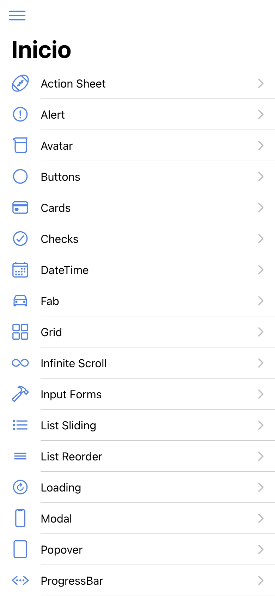
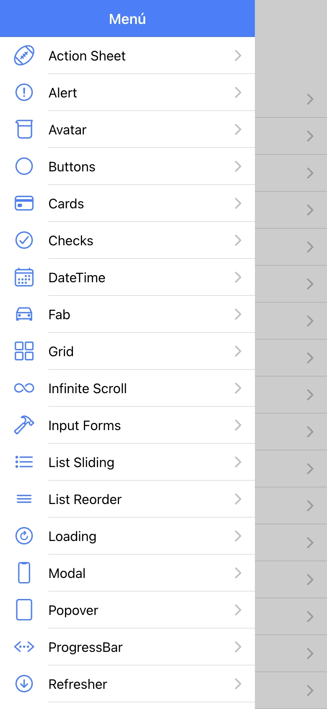
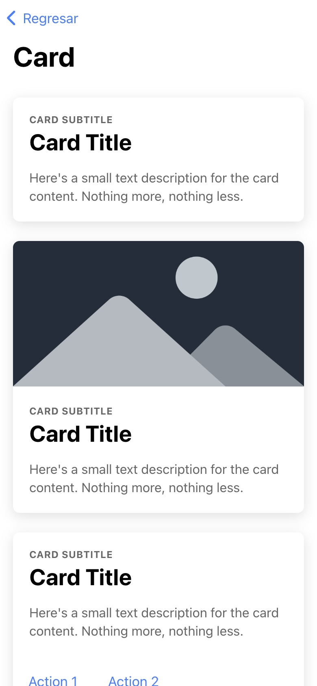
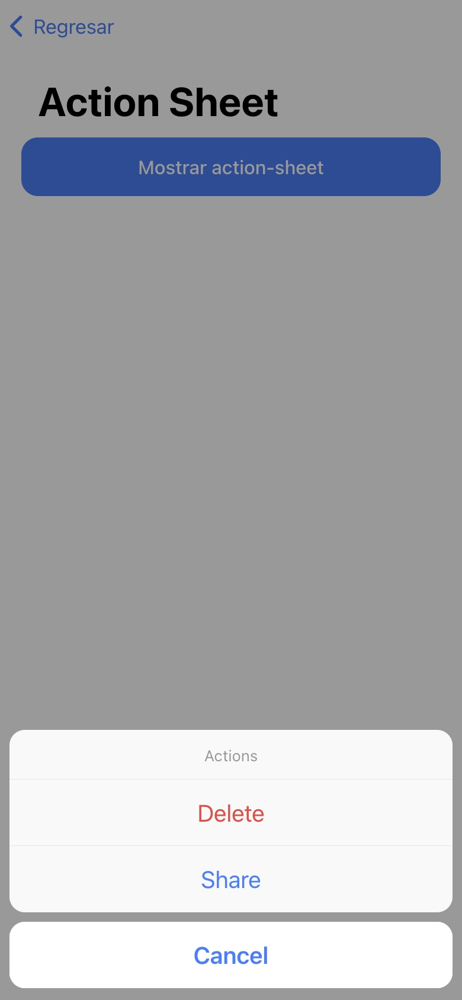
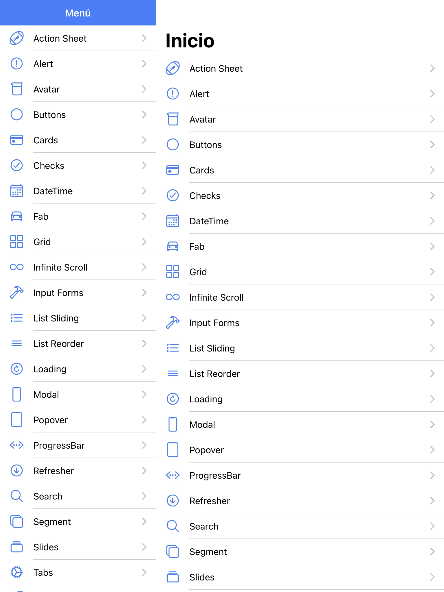

# Ionic Components App

A modern Ionic application showcasing various UI components, built with the latest Angular and Ionic technologies.

## Project Description

This project was originally inspired by **Fernando Herrera's course "Ionic 6: Create iOS and Android Apps with Angular - 2019"** and was developed as part of a **Mobile Application Development class**. 

The application serves as a comprehensive showcase of Ionic components and features, demonstrating how to build mobile applications with modern Angular and Ionic frameworks. It includes examples of various UI components, navigation patterns, and mobile-specific functionalities.

This updated version uses **standalone components** instead of NgModules, representing a modern approach compared to the original course material.

## Features / Differences from the Original Course

This repository has been **completely modernized** compared to the original 2019 course material:

### 🚀 Modern Angular Architecture
- **Angular 20.0.0** - Latest stable version with cutting-edge features
- **Standalone Components** - No more NgModules, using the new standalone architecture
- **New Control Flow Syntax** - Uses modern `@if`, `@for`, and `@switch` instead of `*ngIf`, `*ngFor`
- **Latest TypeScript** - Version 5.8.0 with improved type safety and performance

### 📱 Updated Ionic Framework
- **Ionic 8.7.4** - Latest version with improved performance and new features
- **Capacitor 7.x** - Modern native runtime for enhanced mobile capabilities
- **Ionic Standalone Imports** - Optimized bundle size with tree-shaking

### 🎨 Enhanced Development Experience
- **ESLint 9.x** - Modern linting with improved rules
- **Animate.css 4.x** - Latest animation library integration
- **Swiper 12.x** - Updated carousel/slider component

### Key Modernization Highlights:
- ❌ **No more** `NgModule` declarations
- ❌ **No more** `*ngIf`, `*ngFor`, `*ngSwitch`
- ✅ **Standalone components** with selective imports
- ✅ **Modern control flow** with `@if`, `@for`, `@switch`
- ✅ **Optimized bundle size** through tree-shaking
- ✅ **Improved performance** with latest Angular optimizations

## Screenshots

### Home Screen


### Menu Screen


### Card Page


### Action Sheet Page


### iPad Home Page



## Requirements

Before running this project, ensure you have the following installed:

- **Node.js** (version 18 or higher) - [Download here](https://nodejs.org/)
- **npm** or **yarn** (comes with Node.js)
- **Ionic CLI** (version 7 or higher)
  ```bash
  npm install -g @ionic/cli
  ```
- **Angular CLI** (version 20 or higher)
  ```bash
  npm install -g @angular/cli
  ```

### Optional (for mobile development):
- **Android Studio** (for Android development)
- **Xcode** (for iOS development - macOS only)

## Getting Started

Follow these steps to get the project running on your local machine:

### 1. Clone the Repository
```bash
git clone https://github.com/ivanblueberry/ionic-components-app.git
cd ionic-components-app
```

### 2. Install Dependencies
```bash
npm install
```

### 3. Start Development Server
```bash
ionic serve
```
or
```bash
npm start
```

The application will open in your default browser at `http://localhost:8100`

### 4. Build for Production
```bash
ionic build
```
or
```bash
npm run build
```

## Project Structure

```
src/
├── app/
│   ├── components/          # Reusable UI components
│   │   ├── header/
│   │   ├── large-title/
│   │   └── popover-info/
│   ├── pages/              # Application pages/screens
│   │   ├── action-sheet/
│   │   ├── alert/
│   │   ├── button/
│   │   └── ...
│   ├── services/           # Angular services
│   ├── interfaces/         # TypeScript interfaces
│   └── pipes/              # Custom pipes
├── assets/                 # Static assets
├── theme/                  # Global styling
└── environments/           # Environment configurations
```

## Technologies Used

- **Frontend Framework**: Angular 20.0.0
- **Mobile Framework**: Ionic 8.7.4
- **Native Runtime**: Capacitor 7.4.3
- **Programming Language**: TypeScript 5.8.0
- **Styling**: Sass/SCSS
- **Animation**: Animate.css 4.1.1
- **Icons**: Ionicons 7.0.0

## Available Scripts

- `npm start` or `ionic serve` - Start development server
- `npm run build` - Build for production
- `npm test` - Run unit tests
- `npm run lint` - Run ESLint
- `npm run watch` - Build in watch mode

## Contributing

1. Fork the repository
2. Create a feature branch (`git checkout -b feature/new-feature`)
3. Commit your changes (`git commit -am 'Add new feature'`)
4. Push to the branch (`git push origin feature/new-feature`)
5. Create a Pull Request

## License

This project is for educational purposes. Original course content by Fernando Herrera.

## Acknowledgments

- **Fernando Herrera** - Original course instructor
- **Ionic Team** - For the amazing framework
- **Angular Team** - For the powerful frontend framework
- **Mobile Application Development Class** - For providing the learning context

---

*Built with ❤️ using Angular 20 and Ionic 8*
